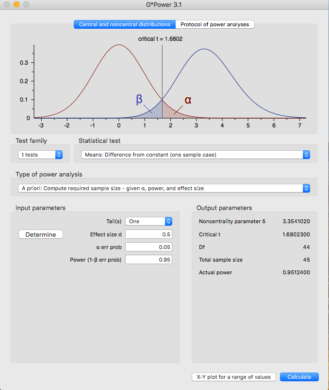
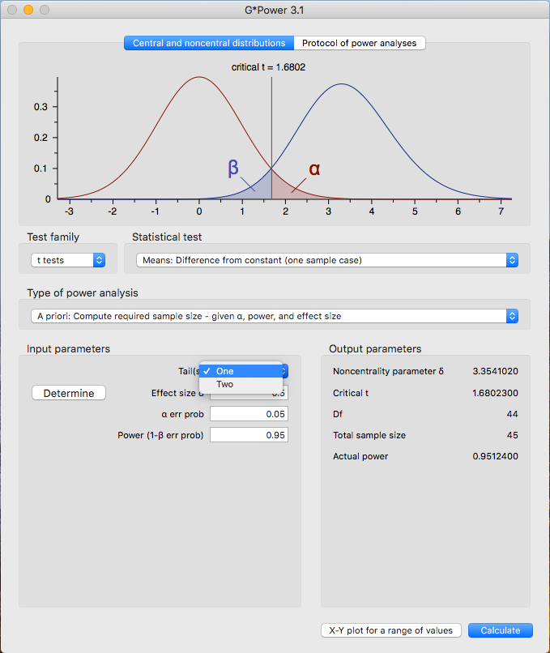

```{r global_options,echo=FALSE}
knitr::opts_chunk$set(fig.width=12, fig.height=8, comment=NA,warning = FALSE)
```

# Hypothesis Testing

Truth Table:

|              | $H_0$ True                         |  $H_0$ Not True                        |   |   |
|--------------|------------------------------------|----------------------------------------|---|---|
| Accept $H_0$ | True Accept (1-$\alpha$)           | False Accept Type II Error $\beta$     |   |   |
| Reject $H_0$ | False Reject Type I error $\alpha$ | True Reject Power (1-$\beta$)          |   |   |
|              |                                    |                                        |   |   |


#### Important Terms

$\alpha$ level - This is what you choose *a priori* (before the experiment).
               - The probability of rejecting the null hypothesis when the null hypothesis is true
               - How much of your result is due to chance?
               - The most common alpha level you will see is .05.
               - Depending on how strict you want your results to be, you may also see values such as .01 and.001.

Degrees of Freedom ($df$) - The number of scores that are free to vary in calculating that statistic
Only need to know N to calculate

$df = N - 1$

Critical Values - Cut-off values that define regions where the test statistic is unlikely to lie
                - Critical values in Table D: Critical Values of Student’s t distribution
                - Need to know alpha level and df to use the table.
                
## T.Test

The T-test, as you will come to see, is quite similar to the z-test. The main differences are where the information is coming from.

If you remember, the z-test takes information from the population such as the mean $\mu$ and standard deviation $\sigma$.

The t-test takes information from the sample instead.

You will notice the formulas are set-up the same way, they just have different numbers.

###Z-Test and T-Test Comparison

$Z = \frac{\bar{X}-\mu}{\sigma_\bar{X}}$ and $t = \frac{\bar{X}-\mu}{\sigma_\bar{X}}$


#### Types of T-Tests

There are three types of T-Tests, but we will only be learning one for today.

- T-Test for single samples  

$$t = \frac{\bar{X}-\mu}{\sigma_\bar{X}}$$

- T-Test for paired samples  

$$t = \frac{\bar{D}}{\sigma_\bar{D}}$$
- T-Test for independent samples  

$$t = \frac{\bar{X}_1 - \bar{X}_2}{\sqrt{\frac{S^2_1}{N_1}+\frac{S^2_2}{N_2}}}$$

##### T-Test Example (R-Calculation)

Let us start off with a sample of 20 scores:

```{r}
set.seed(123)
Reaction_Time = round(rnorm(20,550,10.5),digits=2)
null_mu = 670
t.test(Reaction_Time,mu=null_mu)
```

###### Writing our results

As we discussed in the previous lecture, we will need to make sure to report our findings in proper statistical formats. 

Specifically, when we report the results of a t-test it should look like this:

$$t = -51.897, p <.001$$

##### T-Test Example (Hand-Calculation)

$$t = \frac{\bar{X}-\mu}{\sigma_\bar{X}}$$
Let us imagine we have 10 numbers:

{111.66,117.50,104.82,146.03,134.50,106.52,115.17,114.40,129.36,119.00}

These numbers have a standard deviation of 12.99.

First, we will need to take the mean:

$$\frac{111.66+117.50+104.82+146.03+134.50+106.52+115.17+114.40+129.36+119.00}{10} = 119.896$$

We want to see if this mean is different from the population mean ($\mu$), 126.42.

We will also need to solve for the standard error of the mean ($s_\bar{X}$)

Remember that $s_\bar{X} = \frac{s}{\sqrt{n}}$

$s_\bar{X} = \frac{12.99}{\sqrt{10}} = 4.107$

Our new equation should look something like this: 

$t = \frac{119.896-126.42}{4.107} = -1.588$

$t = -1.588$

You'll notice that when we did the t-test in R we were given a p-value. When you calculate the value by hand, there is no such luck! So, you will have to check for a critical value to see if the value you've calculated is past the rejection zone. 


Let's make sure this works in R as well:

```{r}
x=c(111.66,117.50,104.82,146.03,134.50,106.52,115.17,114.40,129.36,119.00)
t.test(x,mu=126.42)
```


# T-Test for paired Samples 
The t-test for paired samples may also be referred to as the t-test for correlated groups. In both cases, the subjects are measured twice. This can be actualized in a pre-treatment, post-treatment design where participants are measured on some aspect, given a treatment, and then measured again. The $$H_0$$ for these t-tests are that the mean difference is 0. The $$H_1$$ then becomes that the difference is greater than 0 or less than 0. 

When we performed a sign test, we needed to supply R with the difference vector. When we do a paired t-test, we can provide both vectors and R will do the rest for us! 

## T-Test Example 


1. First, create a distribution we can use for reproducibility using `set.seed()`. 
2. Extract and compute the important information from the example you are given.
3. Create both of your vectors first, then combine them into a data frame. It is entirely possible to do all of this in one line, but syntax errors can run rampant when you have multiple arguments being passed at the same time! 
4. Recall that the arguments for `t.test()` when you are using a single sample will not work when you are working with paired samples. 
5. The arguments are as follows: 
  1. `y1,y2` where `y1` and `y2` are both numeric vectors of the *same* length. 
  2. `paired = TRUE``"` This tells R that we are performing a paired t-test. 
  3. `var.equal = TRUE` This tells R that you are assuming the variances of both vectors are the same, by doing this you compute a certain kind of test. More on this later in the semester. 
  4. Making the full function look like this: `t.test(y1, y2, paired = TRUE, var.equal = TRUE)`.

With this in mind, compute the t.test for the following example:


> A researcher is interested in whether students will perform better when they are allowed to use a computer to take notes compared to when they are only allowed to use pen and paper. He has 15 students take notes with pen and paper and then tests them. He then has them take notes with a computer and then tests them. Are the pen and paper test scores worse than the computer test scores? Compute the appropriate test for this design at an $\alpha$ level of .05. 

Use a seed of 3400 to create two samples of 15 students. Our prediction is that the students who use pen and paper to take notes will perform worse on the test compared to the students who use a computer to take notes.  Choose means that will be appropriate for our prediction to be supported (without making the differences *too*…different!)

Calculate the t value for the experiment and report whether or not there is a significance, and if so, what that significance means. 

**Remember that when reporting to follow the proper format:** $$t(df) = t_{obt}, p =$$

After you have your answers, tell me your $$t_{obt}$$ and we will create a vector to show the different values we get. 


## Power 

When we talk about power in the context of an experiment, we are referring to the probability of detecting an effect *if* the effect exists in nature. Power is an important part of experimental design. One of its many uses is in the realm of grant proposals. Let’s imagine you want to run an experiment and you would also like a grant so you can fund the study.  When you propose the study, the board that will be reviewing your claim will want to know if it is likely to work. If you can show them that your experiment has high power, you will need fewer participants to find the effect (if it exists), and will cost less money!

There are several ways to compute power, however, we will focus on the computer assisted method, using a program called G-Power. You will *not* be required to know how to use the program intricately, rather, you will just have to know how to interpret the output of the program as well as input one or two parameters. 


 





### T-Test for Independent Samples

Remember that the t-test for paired samples is also called the t-test for correlated groups. In this sense, they are related. The t-test for independent samples are for unrelated samples. 

We have looked at differences between a calculated sample, and the population mean. We have also looked at differences between two samples in which the participants are the same in order to see if there is a difference less than or greater than zero. 

Using an independent t-test will allow us to see if there are differences among groups. 

Do women interpret emotions better than men?

Do religious individuals give more to charity than their non-religious counterparts?

Do people rate violent actors as more angering than racist actors?

As you can see, it is quite easy to populate this list with more and more hypotheses. 


Consider the following example:

> Gaby has the prettiest garden in all of Long Island. She gets the mots compliments and most pictures taken in her garden. Meanwhile, Kim has just an OK garden; it garners some attention for visitors and gets a few compliments here and there. Gaby would like to see if her garden is quantitatively different from Kim's garden. An independent researcher, David, has vistor services hand a form to all of the patrons that come to the gardens on a particular day. He divides the garden walkways so that some people will only pass by her garden, and some people will only pass Kim's garden. Patrons fill out on the form a rating from 1-5 ranging from attributes such as cleanliness, presentability, attractiveness, and awe-inspiring. These scores are then averaged into a single number. David aims to compare these ratings and see if Gaby's garden is indeed 'better'. He uses an $\alpha$ of .05. What can he conclude?

```{r}
set.seed(5307)
Gaby_Garden <-round(rnorm(25,4.7,2),digits=0)
Gaby_Garden[Gaby_Garden <1] <- 1
Gaby_Garden[Gaby_Garden > 5] <-5
Kim_Garden <-round(rnorm(25,3.1,4),digits=0)
Kim_Garden[Kim_Garden <1] <- 1
Kim_Garden[Kim_Garden > 5] <-5
t.test(Gaby_Garden,Kim_Garden,var.equal = TRUE,alternative = "greater")
```


